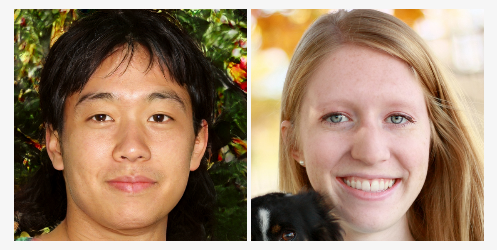
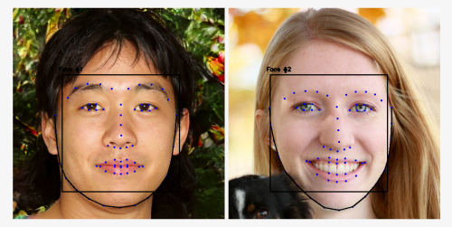

# Facial Landmark Detection
Facial landmarks are most noticeable features of our face, they are key facial attributes in an image. They are identified by knowing shape of the face. We can localize, represent and label them by using ML methods.
Eg :- Nose, Lips, Jawline etc.

We will find landmarks using popular dlib, opencv and python.
Dlib is a toolkit for making real world machine learning and data analysis applications.
OpenCV is used to detect and recognize faces, identify objects, classify human actions in videos, track camera movements etc.

# Overview
In this repo we will be performing two tasks
1. Detect all the faces in the image.
   In this inbuild model of dlib library is used, which detect all the faces in the image using HOG + Linear SVM object            detector.
2. Detect landmark points of faces.
   The facial landmark detector included in the dlib library is an implementation of the One Millisecond Face Alignment with an    Ensemble of Regression Trees paper by Kazemi and Sullivan (2014).
   
   The 68 landmarks will be of jawline, eyebrows, nose, lips, eyes as shown.
   
   
   
   
   
   
# Steps to Set-Up
1. Clone this repository.
2. Enter into the directory

   `cd Facial-Landmark-Detection
3. Install requirements using the following command

   `pip install -r requirements.txt`
4. Run the Facial_Landmark_Detection(1).ipynb in google colab or in terminal like this facial_Landmark_Detection.py file for processing the image

   `python facial_landmark_detection.py`
5. Before running image.py update the name of your image file as 2faces.png which needs to be processed.
6. Image with landmark points will be downloaded/saved in the default folder.
   
# Results

### Sample Image

### Detected results

